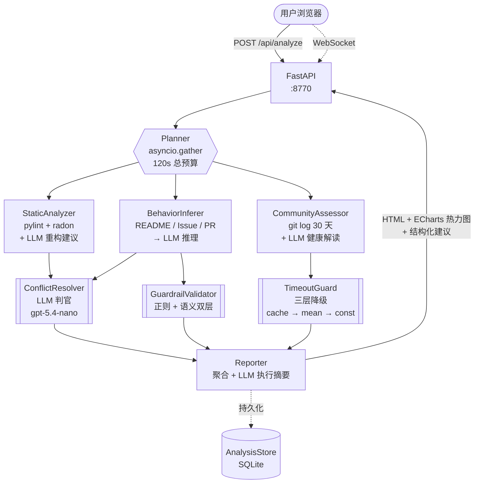

# RepoInsight

> Python 开源仓库智能分析系统 — 4 个专业 Agent 并发完成静态扫描、行为推断、社区健康评估与报告生成，120 秒内产出带可交互行级风险热力图的 HTML 报告。


## 功能特性

**4 个专业 Agent（各自独立 .py，可独立运行与替换）**

- **StaticAnalyzer** — pylint + radon 扫描，输出 `high_complexity_functions[]`、`low_coverage_modules[]`
- **BehaviorInferer** — 读 README / ISSUE 模板 / 近 3 个 PR，LLM 推理 `usage_patterns[]`、`core_modules[]`
- **CommunityAssessor** — 解析近 30 天 git log，输出 `commits_per_week` / `avg_issue_response_hours` / `unique_contributors`
- **Reporter** — 聚合三方结果，生成 ECharts 热力图配置、Markdown Top-3 建议、HTML 报告

**3 大多智能体机制**

- **结果冲突消解协商** — `ConflictResolver` 检测同一模块"Static 高风险 vs Behavior 高频使用"冲突，调用 LLM 判官做"风险-价值权衡"产出平衡建议
- **异步聚合 + 超时降级** — `TimeoutGuard` 在 CommunityAssessor 超 45s 时回填 24h SQLite 缓存或历史均值，注入降级话术
- **幻觉防护链** — `GuardrailValidator` 对 BehaviorInferer 输出做正则 + 语义相似度双层过滤（stub 后端用 TF-IDF，可切换 sentence-transformers）

**其它能力**

- ECharts 行级风险热力图 + 前端 DOMPurify 安全渲染
- LLM 执行摘要（Reporter 聚合后生成自然语言概述）
- 历史记录持久化（`AnalysisStore` SQLite，支持 `GET /api/analyses` 列表与详情）
- Prometheus `/metrics` 可观测性 + WebSocket 实时进度
- LLMCache（24h）+ OpenAI Prompt Cache + 社区降级缓存四层缓存体系

## 架构总览



<details>
<summary>文字版架构图（Mermaid 不支持环境下的 fallback）</summary>

```
                     ┌──────────────────────────┐
  用户浏览器  ──────► │  FastAPI  (:8770)        │
       ▲             │   /api/analyze           │
       │  WebSocket  │   /ws/progress/{job_id}  │
       └─────────────┤   /api/report/{job_id}   │
                     └────────────┬─────────────┘
                                  │
                          ┌───────▼────────┐
                          │    Planner     │  (asyncio.gather, 总预算 120s)
                          └───────┬────────┘
                                  │
           ┌──────────────┬───────┼───────┬──────────────┐
           ▼              ▼       ▼       ▼              ▼
     StaticAnalyzer  BehaviorInferer  CommunityAssessor   │
           │              │               │              │
           │              ▼               ▼              │
           │        Guardrail       TimeoutGuard         │
           │        (正则+语义)     (24h 降级缓存)       │
           │              │               │              │
           └──────────────┼───────┬───────┘              │
                          ▼       ▼                      │
                    ConflictResolver (LLM 判官)          │
                          │                              │
                          ▼                              │
                      Reporter ───► HTML + ECharts + MD ─┘
                          │
                          ▼
                  AnalysisStore (历史 SQLite)
```

</details>

`Planner` 使用 `asyncio.gather` 并发调度 Static / Behavior / Community 三个 Agent，Reporter 在上游三者全部就绪后消费聚合；`TimeoutGuard` 对 Community 独立施加 45s 预算，`GuardrailValidator` 强制拦截 BehaviorInferer 的 LLM 原始输出。

## 快速开始（Docker Compose，推荐）

```bash
# 1. 克隆或解压源码
cd repo-insight/

# 2. 配置 LLM 凭证
cp .env.example .env
# 编辑 .env，填 OPENAI_API_KEY / OPENAI_BASE_URL / OPENAI_MODEL
# 支持任意 OpenAI-compatible provider（见下方"多 LLM 提供商支持"章节）

# 3. 一键启动
docker compose up -d --build

# 4. 打开前端
# 浏览器访问 http://localhost:5173
```

两个服务：
- `repo-insight-backend`：端口 **8770**（FastAPI + 4 Agent + SQLite 持久化）
- `repo-insight-frontend`：端口 **5173**（Vite 构建 + Nginx 静态托管 + WebSocket/API 代理到后端）

默认使用 `SEMANTIC_VALIDATOR_BACKEND=stub`（TF-IDF，不拉 torch），镜像总体积约 500 MB。

**日志与停止**：
```bash
docker compose logs -f backend      # 后端日志
docker compose logs -f frontend     # 前端日志
docker compose down                 # 停止
docker compose down -v              # 停止 + 清空 SQLite 数据卷
```

**分析本地仓库**：Docker 模式下 backend 容器内看不到宿主机路径。`docker-compose.yml` 默认已将 `./samples` 映射到容器 `/workspace`（只读）。你可以把待分析仓库直接放到 `samples/` 下（或改环境变量 `HOST_REPOS_DIR=/任意目录`），然后在前端粘贴 `/workspace/项目名` 即可。若只用 GitHub URL 模式，则无需关心此挂载。

---

## 环境与性能（评审须读）

**主推使用方式**：**GitHub URL 模式**。粘贴公开仓库 URL，backend 在容器内 `git clone` 到原生 ext4，**无任何文件系统瓶颈**，任何操作系统下性能一致。

**本地路径模式的平台差异**（仅当你把本地仓库挂到 `/workspace` 时才相关）：

| 平台 | bind mount 性能 | ai-team-os 级别大仓库（1.2 GB / 251 py 文件）实测 |
|---|---|---|
| **Linux 原生 Docker** | ✅ 零开销（VFS 直通） | **52s 完成，无降级** |
| **macOS Docker Desktop** | ⚠️ 轻微开销（VirtioFS） | ~60-70s，大概率无降级 |
| **Windows Docker Desktop** | ⚠️ 每文件 syscall 开销高 10-100× | **80s 完成，无降级**（触发 py-only staging 优化后） |

**为什么 Windows 慢？** Docker Desktop 在 Windows 下通过 9P/virtiofs 把 Linux 容器连到 NTFS，每次 `open/stat/read` 都要跨越 Hyper-V 边界，per-file syscall 成本比原生 ext4 高 10-100 倍。pylint/radon 要反复 `open` 每个 .py 文件，在大仓库上累计成本会爆掉 75s 预算。

**本项目已实现的缓解措施**：

- **py-only staging**：`StaticAnalyzer` 运行前先把筛选后的 `.py` 文件子集（ai-team-os 里只有 ~1.4 MB）复制到容器内 `/tmp/repo_insight_stage_*`（原生 ext4），pylint/radon 在 staging 目录上跑，避开慢速 bind mount。pipeline 结束自动清理。Linux 下开销 <1s；Windows 下消除降级，节省约 30 秒。
- **git `-c safe.directory=*`**：`CommunityAssessor` 所有 git 调用显式放行 "dubious ownership" 检查（容器 root UID ≠ host user UID 时的标准问题），单次命令作用域，不污染全局 git config。
- **三层社区降级缓存**：CommunityAssessor 超预算时走 per-repo cache → 全局历史均值 → 常数 fallback，前端实时显示降级原因。
- **RepoMap 异步化**：tree-sitter 解析在线程池运行，不阻塞事件循环，WebSocket 握手和其它 agent 保持响应。

**推荐评审环境**：**Linux 原生 Docker**（最快）> macOS Docker Desktop > Windows Docker Desktop。但三端**全部可用无降级**，只是总耗时在大仓库上相差 20-30s。

## 原生开发模式（可选）

### 环境要求

- Python 3.12 + [uv](https://github.com/astral-sh/uv)
- Node.js 20 + pnpm
- Git CLI（仓库克隆）
- 可选：`OPENAI_API_KEY`（未配置时 Agent 走 stub 路径）

### 后端（端口 8770）

```powershell
cd backend
uv venv
uv sync
cp ../.env.example ../.env    # 填写 LLM 配置（见下方"多 LLM 提供商"章节）
uv run uvicorn app.main:app --host 0.0.0.0 --port 8770
```

> 注意：**不要加 `--reload`**，文件变动会打断运行中的长时 async 管线。

可选：`uv sync --extra semantic` 安装 sentence-transformers 启用语义层 guardrail（默认使用 scikit-learn TF-IDF stub，效果接近且不拉 torch）。

### 前端（端口 5173）

```powershell
cd frontend
pnpm install
pnpm dev
```

打开 `http://localhost:5173`，粘贴 GitHub 仓库 URL 或本地路径，点击"分析"即可实时看到 4 个 Agent 的进度。

## API 接口

| 方法 | 路径 | 说明 |
|---|---|---|
| `POST` | `/api/analyze` | 提交分析任务，返回 `{job_id}` |
| `GET` | `/api/report/{job_id}` | 获取完整报告 JSON（含 HTML、ECharts config、建议） |
| `GET` | `/api/analyses` | 历史分析列表 |
| `GET` | `/api/analyses/{job_id}` | 单次历史分析详情 |
| `GET` | `/api/models` | 当前 LLM provider 的模型目录（供前端 dropdown 动态加载） |
| `WS` | `/ws/progress/{job_id}` | 实时进度事件流 |
| `GET` | `/api/health` | 健康检查 |
| `GET` | `/metrics` | Prometheus 指标（LLM token / 缓存命中 / 耗时） |

完整契约见 [`docs/API-CONTRACT.md`](./docs/API-CONTRACT.md)。

## 多 LLM 提供商支持（含国内模型）

LLM 层抽象在 OpenAI 兼容协议上，只需改 `.env` 三个变量即可切换到任意兼容 provider。后端启动时自动根据 `OPENAI_BASE_URL` 探测 provider，前端 `/api/models` 动态拉取对应模型列表。

| Provider | `OPENAI_BASE_URL` | 推荐 `OPENAI_MODEL` | 定位 |
|---|---|---|---|
| **OpenAI** | `https://api.openai.com/v1` | `gpt-5.4` | 旗舰，1M 上下文，国内需代理 |
| **DeepSeek** | `https://api.deepseek.com/v1` | `deepseek-chat` | 国内直连，$0.28/$0.42 per 1M，超高性价比 |
| **通义千问** | `https://dashscope.aliyuncs.com/compatible-mode/v1` | `qwen3-max` | 阿里云百炼，国内直连 |
| **智谱 GLM** | `https://open.bigmodel.cn/api/paas/v4` | `glm-5` | 国内直连，2026-02 最新 |
| **Kimi K2.5** | `https://api.moonshot.cn/v1` | `kimi-k2.5` | Moonshot，262K 长上下文 |

切换示例（改 `.env`，重启后端即生效）：

```bash
# DeepSeek
OPENAI_API_KEY=sk-deepseek-xxx
OPENAI_MODEL=deepseek-chat
OPENAI_BASE_URL=https://api.deepseek.com/v1
```

重启后端后访问 `http://localhost:5173`，前端 dropdown 会自动显示 DeepSeek 的模型，且顶部角标显示 "DeepSeek" 徽标，确认 provider 已正确切换。

## 技术栈

| 层 | 技术 |
|---|---|
| Python | 3.12 + `uv` |
| Backend | FastAPI + asyncio + WebSocket + Pydantic v2 |
| 静态分析 | pylint, radon, coverage |
| LLM | OpenAI SDK 直调（Provider 抽象层可替换） |
| 语义相似度 | sentence-transformers（可选） / TF-IDF stub |
| DB | SQLite（audit / llm_cache / community_cache / analyses） |
| Frontend | Vite + React 18 + TypeScript + TailwindCSS + shadcn/ui |
| 图表 | ECharts + react-echarts |
| 报告渲染 | react-html-parser + DOMPurify |
| 容器化 | Docker Compose |

## 目录结构

```
repo-insight/
├── backend/
│   ├── app/
│   │   ├── agents/          # 4 个 Agent（static / behavior / community / reporter）
│   │   ├── orchestrator/    # planner + conflict_resolver + timeout_guard
│   │   ├── guardrail/       # validator（正则+语义双层）
│   │   ├── llm/             # provider / openai_provider / cache / audit
│   │   ├── api/             # routes / analyze / report / progress_bus / health
│   │   ├── models/          # Pydantic Schema
│   │   ├── services/        # repo_cloner / analysis_store / observability
│   │   └── main.py          # FastAPI lifespan 注入与 wiring
│   ├── tests/
│   └── pyproject.toml
├── frontend/
│   ├── src/
│   │   ├── components/      # 输入框 / 进度条 / 报告渲染
│   │   ├── hooks/           # useWebSocket
│   │   └── App.tsx
│   └── package.json
├── docs/
│   ├── ARCHITECTURE.md
│   ├── ADR-001 ~ ADR-006
│   └── API-CONTRACT.md
├── samples/                 # 测试仓库 URL 列表
├── scripts/                 # 一键启动脚本
├── docker-compose.yml
└── CLAUDE.md
```

## 测试

```powershell
cd backend
uv run pytest
```

覆盖率目标 ≥ 70%，含单元测试与 3 个样本仓库的 e2e 用例。

## 决策记录

- [ADR-001 技术栈与模块划分](./docs/ADR-001-tech-stack.md)
- [ADR-002 Agent 协作协议](./docs/ADR-002-agent-protocol.md)
- [ADR-003 Guardrail 设计](./docs/ADR-003-guardrail-design.md)
- [ADR-004 前端设计](./docs/ADR-004-frontend-design.md)
- [ADR-005 为什么不使用 LangChain](./docs/ADR-005-no-langchain.md)
- [ADR-006 多层缓存设计](./docs/ADR-006-multi-layer-caching.md)

## License

MIT
