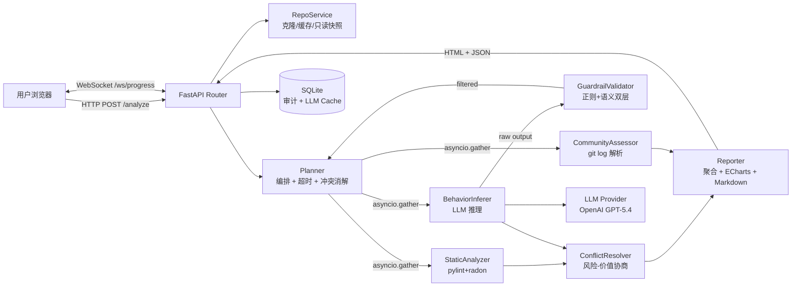
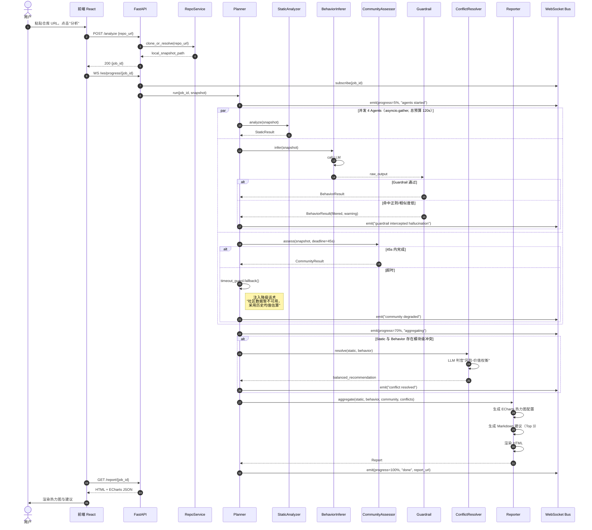
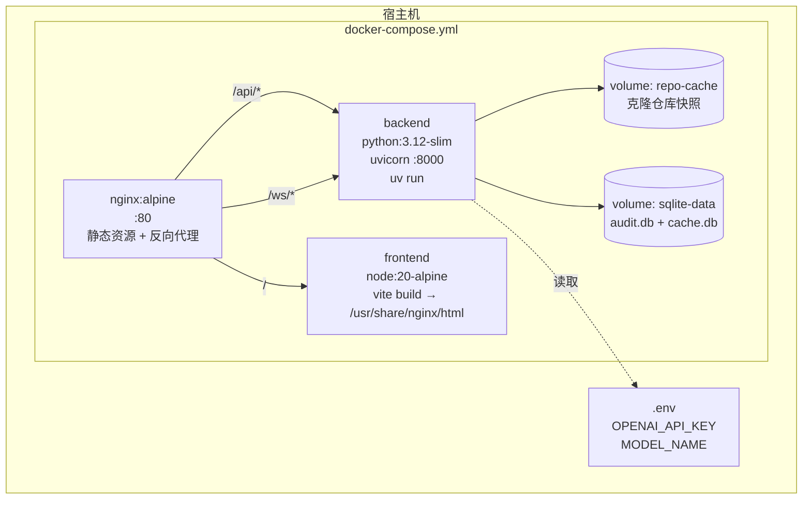

# RepoInsight 系统架构文档

> 配套决策记录：[ADR-001 技术栈与模块划分](./ADR-001-tech-stack.md)

## 1. 系统概览

RepoInsight 是一个面向 Python 开源仓库的智能分析系统。用户提交本地 Git 路径或 GitHub URL 后，系统在 120 秒内通过 4 个专业 Agent（StaticAnalyzer / BehaviorInferer / CommunityAssessor / Reporter）并行完成静态扫描、行为推断、社区健康评估与报告聚合，最终产出一份带 ECharts 行级风险热力图的交互式 HTML 报告，并通过 WebSocket 实时回传分析进度。

## 2. 整体架构图

外部依赖：Git CLI（仓库克隆）、OpenAI API（BehaviorInferer 与冲突协商判官）、sentence-transformers 本地模型（Guardrail 语义层）。

## 3. 模块职责清单（`backend/app/`）

| 子目录 | 模块 | 职责 | 边界约束 |
|---|---|---|---|
| `agents/` | `static_analyzer.py` | 调用 pylint + radon 计算圈复杂度、可维护性指数、覆盖率，输出 `high_complexity_functions[]`、`low_coverage_modules[]` | 不调用 LLM；不读 README；只读文件系统 |
| `agents/` | `behavior_inferer.py` | 读取 README、ISSUE 模板、近 3 个合并 PR，调用 LLM 推理 `usage_patterns[]`、`core_modules[]` | 唯一允许调用 LLM 的 Agent；输出必须经 Guardrail |
| `agents/` | `community_assessor.py` | 解析近 30 天 git log，计算 `commits_per_week`、`avg_issue_response_hours`、`unique_contributors` | 单 Agent 预算 45s，超时由 Planner 接管降级 |
| `agents/` | `reporter.py` | 聚合三方结果，生成 ECharts 热力图配置 + Markdown 建议 + HTML | 不直接采集数据；只消费上游 Schema |
| `orchestrator/` | `planner.py` | 主编排器：并发调度（`asyncio.gather`）、总预算 120s、进度事件广播、调用冲突消解器 | 不直接调用 LLM；不写文件 |
| `orchestrator/` | `conflict_resolver.py` | 检测 Static/Behavior 冲突（同一模块高风险 vs 高频使用），调用 LLM 判官产出平衡建议 | 仅在 Reporter 阶段触发，不阻塞并发 |
| `orchestrator/` | `timeout_guard.py` | 单 Agent 超时检测、降级话术注入、缓存命中回填 | 不感知业务语义，仅做时序控制 |
| `guardrail/` | `validator.py` | 双层过滤：正则禁未来时态 + sentence-transformers 与 README 余弦相似度（阈值 0.35） | 仅作用于 BehaviorInferer 输出 |
| `llm/` | `provider.py` | LLM Provider 抽象基类（`async generate(prompt) -> str`） | 实现可替换：OpenAI / Anthropic / Local |
| `llm/` | `openai_provider.py` | GPT-5.4 实现，含重试、超时、Token 计费回调 | Key 来自 `.env`，禁止硬编码 |
| `llm/` | `cache.py` | 按 `(repo_hash, agent_name, prompt_hash)` 缓存 24h，落 SQLite | 缓存命中需写审计日志 |
| `api/` | `routes.py` | `POST /analyze`、`GET /report/{id}`、`WS /ws/progress/{job_id}` | 不含业务逻辑，仅做参数校验与转发 |
| `api/` | `progress_bus.py` | 进度事件总线（基于 `asyncio.Queue`），Planner 写入、WebSocket 读出 | 单 Job 单 Queue，Job 结束即释放 |
| `models/` | `schemas.py` | Pydantic v2 全部 Schema：`AnalyzeRequest`、`AgentResult`、`Report` | 前后端共享类型源，TS 通过脚本生成 |
| `services/` | `repo_service.py` | Git 克隆/本地路径校验/只读快照/路径白名单 | 禁止执行仓库内任何脚本 |
| `services/` | `audit.py` | SQLite 写入：每次分析记录 `job_id`、`repo`、`agents_status`、`tokens` | 只写不读，查询走专用 read 接口 |
| `main.py` | — | FastAPI 应用入口、生命周期钩子、CORS、依赖注入 | — |

依赖方向（DAG）：`api → orchestrator → agents → {llm, guardrail, services}`，禁止反向引用。`models` 是叶子节点，被所有层引用。

## 4. 数据流时序图（端到端）

## 5. 部署拓扑（Docker Compose）

服务清单：
- **nginx**：唯一对外暴露端口（80），反代 `/api`、`/ws` 到后端，根路径回源 frontend 静态资源
- **backend**：FastAPI + uvicorn，挂载 `repo-cache`、`sqlite-data` 卷，从 `.env` 读取 LLM Key
- **frontend**：构建期容器，产物拷贝到 nginx 静态目录后退出

## 6. 安全与性能关键点

1. **仓库只读隔离**：`RepoService` 克隆到独立 volume，禁止执行仓库内任何 hook、setup.py、pre-commit 脚本；路径白名单校验防目录穿越
2. **LLM 密钥隔离**：`OPENAI_API_KEY` 仅存在于 `.env`，通过 Pydantic Settings 注入；禁止出现在日志、审计表、错误响应中
3. **总预算硬切**：Planner 使用 `asyncio.wait_for(gather, timeout=120)`，超总预算立即取消未完成 Agent 并返回部分结果，前端展示降级状态
4. **LLM 缓存抗压**：相同 `(repo_hash, agent_name)` 24h 内命中缓存，极大降低重复分析的 Token 成本与延迟；缓存命中率写入审计供后续优化
5. **Guardrail 不可绕过**：`BehaviorInferer.infer()` 的返回值在 Planner 层强制经 `GuardrailValidator.validate()`，单元测试覆盖"绕过路径不存在"用例（依赖方向校验）
