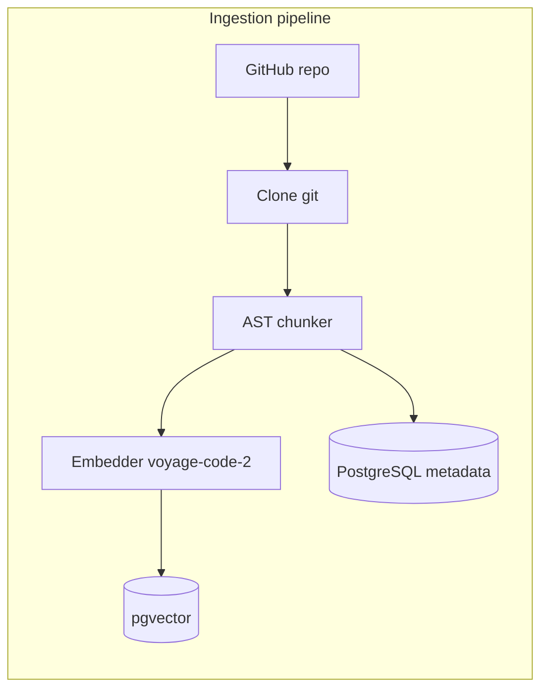
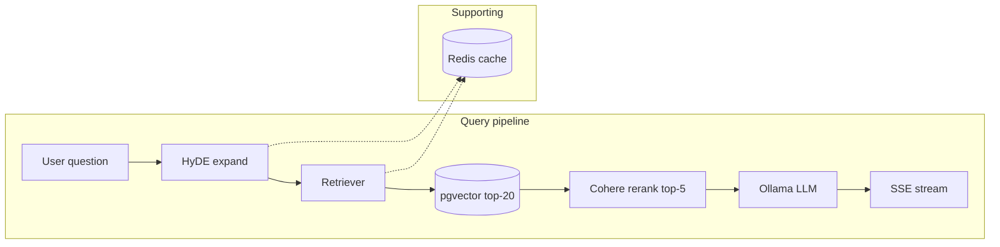

# CodeBase Q&A with RAG

Ask natural-language questions about a GitHub repository. The app clones the repo, chunks code with **tree-sitter** (AST-aware), embeds chunks with **Voyage AI** (`voyage-code-2`), stores vectors in **PostgreSQL + pgvector**, and answers questions using **HyDE** (hypothetical code generation), **Cohere reranking**, and a **local LLM via Ollama** with streaming responses.

---

## Architecture

Two pipelines: **ingestion** (once per repo / on webhook) and **query** (every question).





- **Ingestion:** `git` clone → walk supported files → **tree-sitter** chunks (functions/classes) → **Voyage** embeddings → upsert into `chunks` with vectors.
- **Query:** **HyDE** produces a hypothetical code snippet (via **Ollama**) → embed with Voyage → **pgvector** ANN search (top 20) → **Cohere rerank** to top 5 → build prompt → **Ollama** streams tokens over **SSE**.
- **Async jobs:** **Celery** workers use **Redis** as broker/backend for `index_repo_task` (and webhook re-index).
- **Cache:** Redis stores retrieval results keyed by `SHA256(query + repo_id + top_k)` with a 1-hour TTL.

Design docs may mention **Qdrant**, **BullMQ**, or **Claude**; **this repository** uses **pgvector only**, **Celery + Redis** for the queue, and **Ollama** for HyDE and answers (not Anthropic in code). You can swap the answerer/HyDE backends by editing `app/query/hyde.py` and `app/query/answerer.py`.

---

## Tech stack (as implemented)

| Layer | Choice | Notes |
|--------|--------|--------|
| API | FastAPI | REST + SSE streaming on `/query` |
| Worker | Celery + Redis | Background indexing |
| DB | PostgreSQL + **pgvector** | `repos` + `chunks` with embeddings |
| Embeddings | Voyage **`voyage-code-2`** | Indexing + query vectors |
| Chunking | **tree-sitter** | Python + JavaScript/TS parsers |
| HyDE | **Ollama** (e.g. CodeLlama) | Hypothetical code for better retrieval |
| Reranker | **Cohere** `rerank-english-v3.0` | 20 → 5 candidates |
| LLM | **Ollama** | Streaming generation |
| Cache | Redis | Retrieval cache |
| Frontend | React + Vite | UI in `Frontend/` |
| Evals (optional) | RAGAS | Listed in `pyproject.toml` |

---

## Repository layout

```
.
├── app/
│   ├── main.py              # FastAPI app, routes, lifespan
│   ├── db/                  # SQLAlchemy models & DB helpers
│   ├── ingestion/
│   │   ├── cloner.py        # git clone, file walk
│   │   ├── chunker.py       # tree-sitter AST chunks
│   │   ├── embedder.py      # Voyage embeddings
│   │   └── indexer.py       # pgvector upserts
│   ├── query/
│   │   ├── hyde.py          # HyDE via Ollama
│   │   ├── retriever.py     # embed, search, rerank, Redis cache
│   │   └── answerer.py      # Ollama streaming answer
│   └── workers/
│       └── tasks.py         # Celery: index_repo_task
├── Frontend/                # React + Vite UI
├── migrations/              # Alembic migrations
├── pyproject.toml
├── alembic.ini
└── test_it.py               # Example HTTP flow against the API
```

---

## Prerequisites

- Python **3.11+** (project uses `uv` or Poetry-style deps in `pyproject.toml`)
- **PostgreSQL** with the **pgvector** extension and a database URL
- **Redis** (broker for Celery + retrieval cache)
- **Ollama** running locally (HyDE + answers), with a compatible model pulled
- API keys: **Voyage AI**, **Cohere** (optional: **GitHub token** for private repos)

---

## Environment variables

Set these (e.g. in a `.env` file loaded by the app):

| Variable | Purpose |
|----------|---------|
| `DATABASE_URL` | PostgreSQL connection string (asyncpg-compatible; query params may be stripped for SSL) |
| `REDIS_URL` | Redis for Celery and `retrieve()` cache |
| `VOYAGE_API_KEY` | Voyage embeddings |
| `COHERE_API_KEY` | Cohere rerank |
| `OLLAMA_BASE_URL` | e.g. `http://127.0.0.1:11434` |
| `OLLAMA_MODEL` | Model name for HyDE + answering |
| `GITHUB_TOKEN` | Optional; injected for private GitHub clones |

HyDE defaults in code point at `http://localhost:11434` and `codellama:7b` unless overridden—align these with your Ollama setup.

---

## Setup

1. **Install dependencies** (example with `uv`):

   ```bash
   uv sync
   ```

2. **Run database migrations** (Alembic):

   ```bash
   uv run alembic upgrade head
   ```

3. **Start Ollama** and ensure the model used in `hyde.py` / env is available.

4. **Start the API:**

   ```bash
   uv run uvicorn app.main:app --host 127.0.0.1 --port 8000
   ```

5. **Start a Celery worker** (required for indexing):

   ```bash
   uv run celery -A app.workers.tasks.celery worker --loglevel=info
   ```

6. **Start the frontend** (optional):

   ```bash
   cd Frontend && npm install && npm run dev
   ```

   Point the UI at `http://127.0.0.1:8000` (see `API_BASE_URL` in `Frontend/src/App.jsx`).

---

## API overview

| Method | Path | Description |
|--------|------|-------------|
| `POST` | `/repos` | Body: `{ "github_url": "..." }` — enqueue indexing; returns `repo_id` and `status` |
| `GET` | `/repos/{repo_id}/status` | `{ status, indexed_at }` — poll until `ready` or `error` |
| `POST` | `/query` | Body: `{ "repo_id", "question" }` — SSE stream of answer tokens |
| `POST` | `/webhooks/github` | Re-index on push to default branch (if repo already registered) |

Indexing can fail with vendor **rate limits** (e.g. Voyage billing / RPM). Fix account limits or adjust embedding batching; the worker marks the repo `error` on failure.

---

## Query pipeline (concept)

1. **HyDE:** Turn the user question into a short hypothetical code snippet (better match for code embeddings than raw NL).
2. **Embed** that snippet with the same Voyage model used at index time (`input_type="query"`).
3. **Vector search:** Top 20 rows from `chunks` by cosine distance in pgvector.
4. **Rerank:** Cohere compresses to top 5.
5. **Answer:** Ollama streams an answer with file/line context in the prompt.

---

## License

See project license if provided; dependencies have their own licenses.
