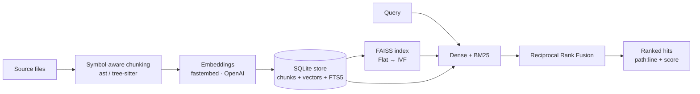

# 🔎 CodeRAG

**A standalone, local-first semantic code-search engine for large and custom codebases.**

[](https://www.python.org/downloads/)
[](https://opensource.org/licenses/Apache-2.0)
[](https://github.com/Neverdecel/CodeRAG/actions/workflows/ci-tests.yml)

CodeRAG indexes a whole codebase into a hybrid (vector + keyword) search index and answers
questions like *"where is retry/backoff handled?"* with the exact functions, classes, and
files that matter — ranked by meaning, not just string match.

It runs **entirely on your machine with no API key** (a local ONNX embedding model is the
default), keeps its index **up to date as you edit**, and is built to stay fast on **large
codebases**. Use it from the **CLI**, embed it as a **Python library**, self-host it as an
**HTTP service**, or browse with the **web UI**.

> Built for the cases off-the-shelf IDE assistants don't cover well: a codebase that's too
> big, too private, or too custom — or a search/RAG capability you want to own and embed in
> your own tools.

---

## ✨ Highlights

- **Local-first, zero-key.** Default embeddings run locally via [fastembed](https://github.com/qdrant/fastembed) (ONNX, no PyTorch). OpenAI is optional.
- **Symbol-aware chunking.** Indexes *functions, classes, and methods* (Python via `ast`; JS/TS/Go/Rust/Java via tree-sitter), not crude fixed-size blocks — so results point at real code units with `file:line` citations.
- **Hybrid retrieval.** Dense vector search **+** BM25 keyword search, fused with Reciprocal Rank Fusion. Great at both "what does this *mean*" and exact-identifier lookups.
- **Incremental & live.** Content-hashed indexing only re-embeds files that changed; a debounced watcher keeps the index current as you code. No duplicate or stale vectors.
- **Built to scale.** Exact `Flat` search for small repos, automatic switch to approximate `IVF` past a threshold so it stays fast at 100k+ chunks.
- **Four surfaces, one engine.** CLI · Python library · HTTP/REST · Streamlit UI — all thin wrappers over the same `CodeRAG` object.

## 🚀 Quick start

```bash
pip install -e .            # core engine (local embeddings included)
# optional extras:
pip install -e ".[server]"  # HTTP/REST API
pip install -e ".[ui]"      # Streamlit web UI
pip install -e ".[openai]"  # OpenAI embeddings / LLM answers
```

Index a codebase and search it — no configuration, no API key:

```bash
coderag index --watched-dir /path/to/your/repo
coderag search "where are duplicate vectors removed on file change" --watched-dir /path/to/your/repo
```

```
1. coderag/indexer.py:141 (Indexer._index_file)  [method, sim=0.70]
   def _index_file(self, item): removed = 0; existing = self.store.get_file(item.rel) …
2. coderag/indexer.py:1  [window, sim=0.74]
   """Incremental indexing orchestration. ...the critical correctness property…"""
```

By default the index lives in `./.coderag/`. Set `CODERAG_WATCHED_DIR` / `CODERAG_STORE_DIR`
(or copy `example.env` to `.env`) to avoid repeating flags.

## 🧑‍💻 The four surfaces

### CLI

```bash
coderag index [PATH] [--full]     # build / incrementally update the index
coderag search "QUERY" [-k 8]     # hybrid search; add --json or --answer
coderag watch                     # index, then keep it live as files change
coderag serve --port 8000         # run the HTTP API  (needs [server])
coderag ui                        # launch the web UI (needs [ui])
coderag status                    # index stats (files, chunks, model, index type)
```

### Python library

```python
from coderag import CodeRAG, Config

cr = CodeRAG(Config.from_env(watched_dir="/path/to/repo"))
cr.index()

for hit in cr.search("how is the FAISS index persisted?"):
    print(f"{hit.location}  {hit.symbol}  (sim={hit.similarity:.2f})")
    print(hit.text)
```

### HTTP / REST  (`coderag serve`)

```bash
curl "http://127.0.0.1:8000/search?q=token%20validation&k=5"
curl -X POST http://127.0.0.1:8000/index -d '{"full": false}' -H 'content-type: application/json'
curl "http://127.0.0.1:8000/status"
curl "http://127.0.0.1:8000/file?path=coderag/api.py&start_line=1&end_line=40"
```

Self-host it once and point any number of custom apps or teammates at a big shared codebase.

### Web UI  (`coderag ui`)

Streamlit app: search box, retrieved chunks with `path:line` citations and similarity
scores, a one-click **Reindex** button, and an optional streamed LLM answer (when an OpenAI
key is configured).

## 🏗️ How it works



- **SQLite is the source of truth** (chunk text, line ranges, symbols, content hashes, and the
  raw vectors). The **FAISS index is a rebuildable cache** — it can always be reconstructed
  from SQLite, so switching models or index types never corrupts your data.
- Each file's content is **hashed**; unchanged files are skipped on re-index. A changed file's
  old chunks are removed from *both* the store and the vector index **before** new ones are
  added — so editing never accumulates stale or duplicate vectors.

## ⚙️ Configuration

Everything is configurable via `CODERAG_*` environment variables or a `.env` file (see
[`example.env`](example.env)). Common ones:

| Variable | Default | Meaning |
| --- | --- | --- |
| `CODERAG_PROVIDER` | `fastembed` | `fastembed` (local) · `openai` · `fake` |
| `CODERAG_MODEL` | `BAAI/bge-small-en-v1.5` | Local embedding model |
| `CODERAG_WATCHED_DIR` | cwd | Codebase to index |
| `CODERAG_STORE_DIR` | `./.coderag` | Where the DB + index live |
| `CODERAG_INDEX_TYPE` | `auto` | `auto` · `flat` · `ivf` |
| `CODERAG_IVF_THRESHOLD` | `50000` | Vectors before switching Flat → IVF |
| `CODERAG_TOP_K` | `8` | Results returned |
| `OPENAI_API_KEY` | – | Needed only for OpenAI embeddings / answers |

## 🧩 Supported languages

Symbol-aware (function/class/method level): **Python, JavaScript, TypeScript/TSX, Go, Rust,
Java**. Many other languages and docs (C/C++, Ruby, PHP, Markdown, YAML, …) are indexed with
a line-window fallback, so they remain searchable.

## 🛠️ Development

```bash
python -m venv venv && source venv/bin/activate
pip install -e ".[dev,server,openai]"

pytest -m "not integration"     # fast, offline (uses a deterministic fake embedder)
pytest -m integration           # exercises the real local model (downloads once)
black --check . && isort --check-only . && flake8 coderag tests && mypy coderag
```

See [DEVELOPMENT.md](DEVELOPMENT.md) and [AGENTS.md](AGENTS.md) for architecture and
contribution details.

## 📄 License

Apache License 2.0 — see [LICENSE](LICENSE-2.0.txt).

## 🙏 Acknowledgments

[FAISS](https://github.com/facebookresearch/faiss) · [fastembed](https://github.com/qdrant/fastembed) ·
[tree-sitter](https://tree-sitter.github.io/tree-sitter/) · [FastAPI](https://fastapi.tiangolo.com/) ·
[Streamlit](https://streamlit.io/) · [watchdog](https://github.com/gorakhargosh/watchdog)

---

**⭐ If CodeRAG helps you, please give it a star!**
